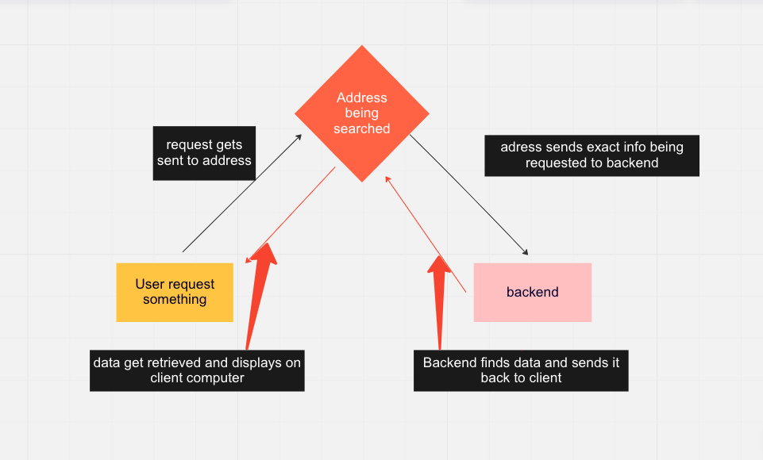
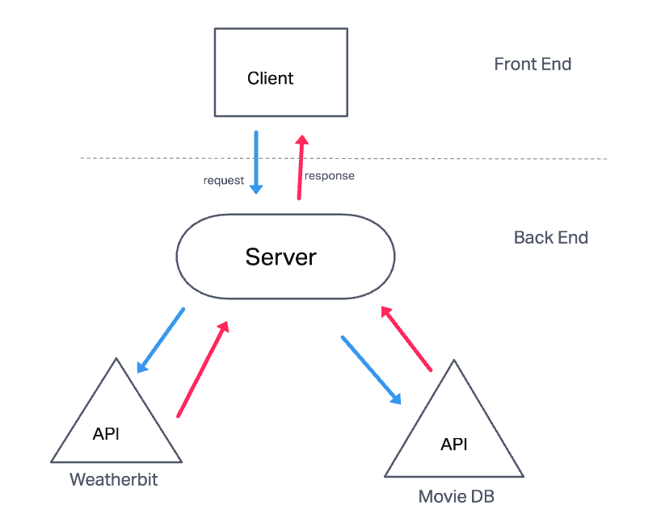
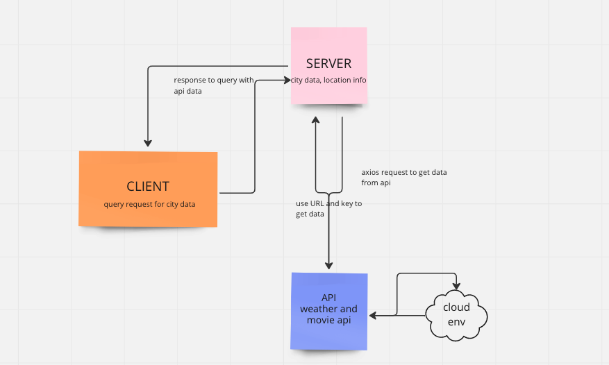

# city-explorer-backend

**Author**: Ricardo Soto-Fabela
**Version**: 1.0.0 (increment the patch/fix version number if you make more commits past your first submission)

## Overview
* setting up a backend server
<!-- Provide a high level overview of what this application is and why you are building it, beyond the fact that it's an assignment for this class. (i.e. What's your problem domain?) -->

## Getting Started
<!-- What are the steps that a user must take in order to build this app on their own machine and get it running? -->

## Architecture
<!-- Provide a detailed description of the application design. What technologies (languages, libraries, etc) you're using, and any other relevant design information. -->

## Change Log
<!-- Use this area to document the iterative changes made to your application as each feature is successfully implemented. Use time stamps. Here's an example:

01-01-2001 4:59pm - Application now has a fully-functional express server, with a GET route for the location resource. -->

## Credit and Collaborations

* kayen
* harper
* angelos
* gordon
* todd
* tracy
* Ian

Name of feature: lab 7- Custom Servers with Node and Express

Estimate of time needed to complete: 6 hours

Start time: 2:30 pm

Finish time: 6:30 pm the next day

Actual time needed to complete: 16 hours

Name of feature: lab 8- APIs

Estimate of time needed to complete: 5 hours

Start time: 7:00 pm

Finish time: 8:30 pm

Actual time needed to complete: 13 hours

Name of feature: lab 9- Refactoring into Modules

Estimate of time needed to complete: TBD

Start time: TBD

Finish time: TBD

Actual time needed to complete: TBD

